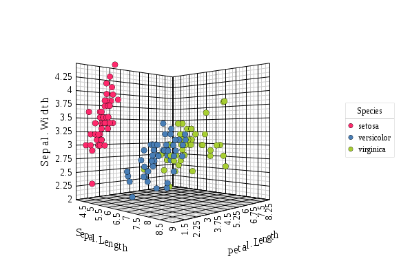
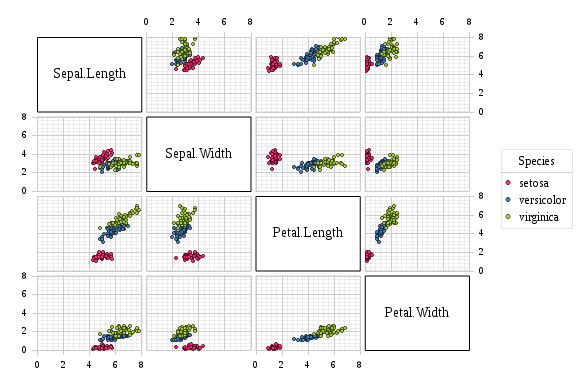
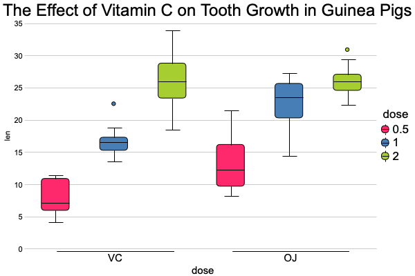
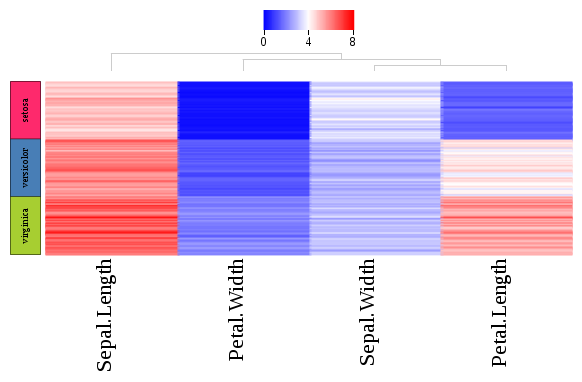
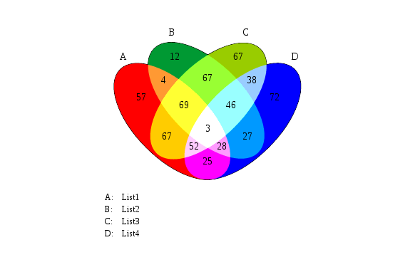

<a href="http://www.canvasxpress.org"></a>

<!-- Badge Location -->
[](https://cran.r-project.org/package=canvasXpress)
[](https://cran.r-project.org/package=canvasXpress)
[](https://cdnjs.com/libraries/canvasXpress)
[](https://travis-ci.org/cb4ds/canvasXpress)
[](https://codecov.io/github/cb4ds/canvasXpress?branch=master)
<!-- End Badges -->

***canvasXpress*** was developed as the core visualization component for bioinformatics and systems biology analysis
at Bristol-Myers Squibb. It supports a large number of [visualizations ](http://www.canvasxpress.org/html/gallery.html)to display scientific and non-scientific
data. ***canvasXpress*** also includes a simple and unobtrusive [user interface](http://www.canvasxpress.org/html/user-interface.html) to explore complex data sets, a sophisticated and unique mechanism to keep track of all user customization for [Reproducible Research ](http://www.canvasxpress.org/html/reproducible-research.html) purposes, as well as an 'out of the box'
broadcasting capability to synchronize selected data points in all ***canvasXpress*** plots in a page. Data can
be easily sorted, grouped, transposed, transformed or clustered dynamically. The fully customizable mouse events
as well as the zooming, panning and drag-and-drop capabilities are features that make this library unique in its
class.

***canvasXpress*** can be now simply used within R at the console to generate conventional plots, in R-Studio
or seamlessly embedded in [Shiny](http://shiny.rstudio.com) web applications. Full-fledged examples of the ***canvasXpress*** library including the mouse events, zooming, and broadcasting capabilities are included in this package in several examples that can be accessed using the cxShinyExample function.  This ***canvasXpress*** R library was created with the [htmlwidgets](https://github.com/ramnathv/htmlwidgets) package.

### Installation

canvasXpress is available for installation from 
[CRAN](https://CRAN.R-project.org/package=canvasXpress) or you can install the
latest version of ***canvasXpress*** from GitHub as follows:

```r
devtools::install_github('neuhausi/canvasXpress')
```

### Examples

These are included to get you started on basic charting - there are many more
examples (including complex and compound visualizations) with R code available 
in the Examples section of the main website at 
[http://canvasxpress.org](http://canvasxpress.org)

#### Scatter 3D Plot

```r
y <- read.table("http://www.canvasxpress.org/data/cX-irist-dat.txt", header=TRUE, sep="\t", 
                quote="", row.names=1, fill=TRUE, check.names=FALSE, stringsAsFactors=FALSE)
z <- read.table("http://www.canvasxpress.org/data/cX-irist-var.txt", header=TRUE, sep= "\t", 
                quote="", row.names=1, fill=TRUE, check.names=FALSE, stringsAsFactors=FALSE)

canvasXpress(data      = y,
             varAnnot  = z,
             graphType ="Scatter3D",
             colorBy   = "Species",
             ellipseBy = "Species",
             xAxis     = list("Sepal.Length"),
             yAxis     = list("Petal.Width"),
             zAxis     = list("Petal.Length"),
             theme     = "CanvasXpress",
             title     = "Iris Data Set",
             axisTickScaleFontFactor  = 0.5,
             axisTitleScaleFontFactor = 0.5)
```


#### Scatter 2D Matrix Plot

```r
y <- read.table("http://www.canvasxpress.org/data/cX-irist-dat.txt", header=TRUE, sep="\t", 
                quote="", row.names=1, fill=TRUE, check.names=FALSE, stringsAsFactors=FALSE)
z <- read.table("http://www.canvasxpress.org/data/cX-irist-var.txt", header=TRUE, sep= "\t", 
                quote="", row.names=1, fill=TRUE, check.names=FALSE, stringsAsFactors=FALSE)

canvasXpress(data              = y,
             varAnnot          = z,
             graphType         = "Scatter2D",
             colorBy           = "Species",
             layoutAdjust      = TRUE,
             scatterPlotMatrix = TRUE,
             theme             = "CanvasXpress")
```


#### Boxplot

```r
y <- read.table("http://www.canvasxpress.org/data/cX-toothgrowth-dat.txt", header=TRUE, sep="\t", 
                quote="", row.names=1, fill=TRUE, check.names=FALSE, stringsAsFactors=FALSE)
x <- read.table("http://www.canvasxpress.org/data/cX-toothgrowth-smp.txt", header=TRUE, sep="\t", 
                quote="", row.names=1, fill=TRUE, check.names=FALSE, stringsAsFactors=FALSE)

canvasXpress(data                  = y,
             smpAnnot              = x,
             graphType             = "Boxplot",
             groupingFactors       = list("dose", "supp"),
             stringSampleFactors   = list("dose"),
             graphOrientation      = "vertical",
             colorBy               = "dose",
             title                 = "The Effect of Vitamin C on Tooth Growth in Guinea Pigs",
             smpTitle              = "dose",
             xAxisTitle            = "len",
             smpLabelRotate        = 90,
             xAxisMinorTicks       = FALSE,
             xAxis2Show            = FALSE,
             legendScaleFontFactor = 1.8)
```


#### Heatmap (Multi-dimensional)

```r
y  <- read.table("http://www.canvasxpress.org/data/cX-multidimensionalheatmap-dat.txt", header=TRUE, sep="\t", 
                 quote="", row.names=1, fill=TRUE, check.names=FALSE, stringsAsFactors=FALSE)
y2 <- read.table("http://www.canvasxpress.org/data/cX-multidimensionalheatmap-dat2.txt", header=TRUE, sep="\t", 
                 quote="", row.names=1, fill=TRUE, check.names=FALSE, stringsAsFactors=FALSE)
y3 <- read.table("http://www.canvasxpress.org/data/cX-multidimensionalheatmap-dat3.txt", header=TRUE, sep="\t", 
                 quote="", row.names=1, fill=TRUE, check.names=FALSE, stringsAsFactors=FALSE)
y4 <- read.table("http://www.canvasxpress.org/data/cX-multidimensionalheatmap-dat4.txt", header=TRUE, sep="\t", 
                 quote="", row.names=1, fill=TRUE, check.names=FALSE, stringsAsFactors=FALSE)
x  <- read.table("http://www.canvasxpress.org/data/cX-multidimensionalheatmap-smp.txt", header=TRUE, sep= "\t", 
                 quote="", row.names=1, fill=TRUE, check.names=FALSE, stringsAsFactors=FALSE)
z  <- read.table("http://www.canvasxpress.org/data/cX-multidimensionalheatmap-var.txt", header=TRUE, sep= "\t", 
                 quote="", row.names=1, fill=TRUE, check.names=FALSE, stringsAsFactors=FALSE)

canvasXpress(data                 = list(y = y, data2 = y2, data3 = y3, data4 = y4),
             smpAnnot             = x,
             varAnnot             = z,
             graphType            = "Heatmap",
             guides               = TRUE,
             outlineBy            = "Outline",
             outlineByData        = "data2",
             shapeBy              = "Shape",
             shapeByData          = "data3",
             sizeBy               = "Size",
             sizeByData           = "data4",
             showHeatmapIndicator = FALSE,
             afterRender          = list(list("clusterSamples")))
```


#### Four way Venn Diagram

```r
canvasXpress(vennData   = data.frame(AC=456, A=340, ABC=552, ABCD=148, BC=915, ACD=298, BCD=613, 
                                     B=562, CD=143, ABD=578, C=620, D=592, AB=639, BD=354, AD=257),
             graphType  = "Venn",
             vennLegend = list(A="List 1", D="List 4", C="List 3", B="List 2"),
             vennGroups = 4)
```



### More Examples and Resources

In addition to the built-in package documentation there are vignettes with 
more information on getting started and additional examples:

```r
#List all package vignettes
vignette(package = "canvasXpress")

#View a specific vignette
vignette("getting_started", package = "canvasXpress")
vignette("additional_examples", package = "canvasXpress")
```

For the use of canvasXpress plots in shiny there are interactive examples available through the
package function *cxShinyExample*

```r
#List example names
cxShinyExample()

#Run an interactive shiny example
cxShinyExample(example = "example1")
```

There is also a wealth of additional information including full API documentation 
and extensive R and JavaScript examples at [http://www.canvasxpress.org](http://www.canvasxpress.org).
